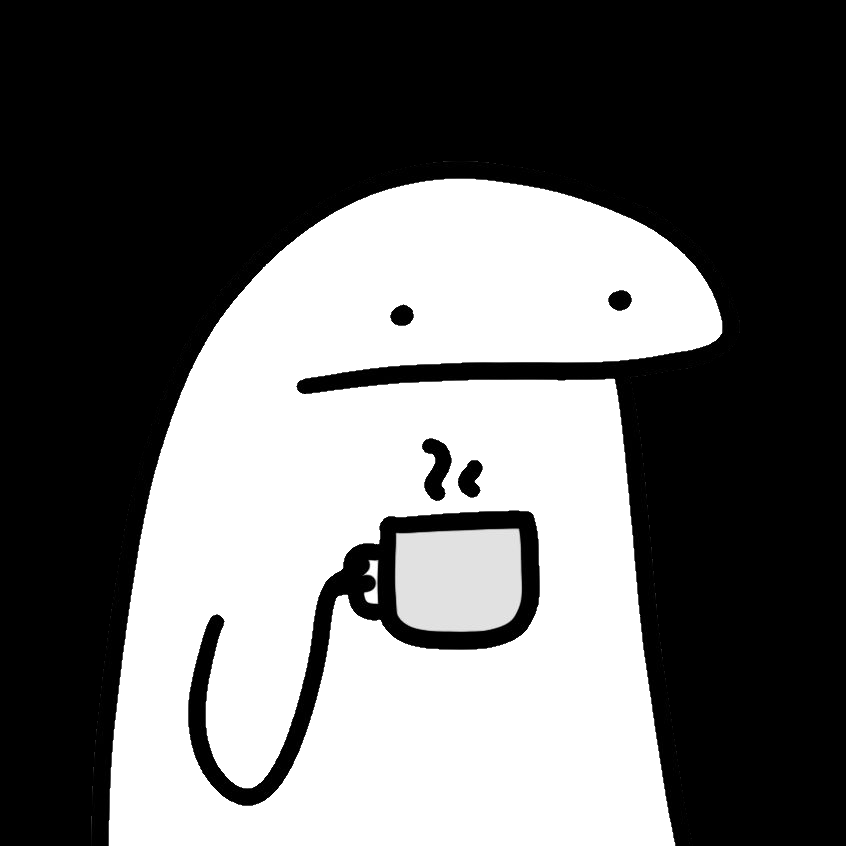

  
   
  

  <a href="/">English</a> | <a href="/cn">简体中文</a>
  

# 👋 Hello, I'm mingcheng.

It is extremely stressful for me to have to reintroduce myself each time I participate in community events. So, I created this page to tell you more about me.

## 🏠 Essential Information

I was raised in Ningbo, which is a small city in the east of mainland China. I graduated from [Zhejiang University of Science and Technology(ZUST)](https://en.zust.edu.cn) in 2008, and I am currently pursuing studies at [Shanghai International Studies University (SISU)](https://en.shisu.edu.cn).

I am a PPMC & Committer at the [Apache Software Foundation](https://www.apache.org/) and an open-source evangelist working for the [Ant Group](https://github.com/antgroup).

I formerly worked for companies and teams including `Alibaba (Taobao)`, `NetEase`, and `Sifou` as a developer, architect, technical lecturer, technical lead and general manager.

I use Golang, Java, Typescript, Python, PHP, and other tech stacks in my many years of programming and architecture work. I'm currently learning Rust and the Zig language.

I also have deep experience in the management of technical teams, the development of open source projects, and the promotion of technical communities.

<!--
## 🎣 Hobbies and Interests
-->

## 🚗 Work Experience

### 🐜 Technical Evangelist, Ant Group, Present

I am responsible for supervising the management, technical evangelism, and effects of [Ant Group's open source programs](https://opensource.antgroup.com) over the [whole organization](https://github.com/antgroup).

### 🪶 PMC & Committer, Apache Community, Present

Participated in the Apache Foundation [Apache Answer Project](https://answer.apache.org/) as an Apache PPMC & Committer, which is in charge of code review, voting for new versions, project development.

### 💻 Chief Architect, Hangzhou Sifou Technology Co., Ltd., from June 2022 to August 2023

In my capacity as Chief Architect at Sifou, I was in charge of technology development, solution evaluation, and other responsibilities.

I supervised the Answer project's startup development, technology selection, and architectural design. The Apache Foundation later accepted the project as an incubated project.

### ☁️ Co-Founder, Hangzhou Mission Technology Co., Ltd., June 2020 to May 2022

The main goal during the starting period was to implement "SaaS" solutions in the field of RPA (robotic process automation). 

These solutions primarily provided corporations and small and medium-sized businesses with data-based automated process services.

### 💰 Technical Partner (GP), Hangzhou Ouer Technology Co., Ltd. September 2019 ─ May 2020

I am responsible for assessing the technical expenses, potential hazards, and timelines of initial projects for the venture capital fund, in addition to offering management advice, fostering team growth, technical direction, and overseeing post-investment activities.

### 🎮 Technical Lead, Architect, NetEase (Hangzhou) Network Co., Ltd., February 2016–September 2019

During my time at NetEase, my primary responsibility was to provide comprehensive technical management.

In this capacity, I was primarily responsible for developing and supervising a wide range of platforms and projects.

### 💊 Head of Frontend Technology at Guanlan Network Technology Co., Ltd. from June 2011 to December 2015

I was a member of the DXY founding team and worked on client-side and server-side projects, including "DingXiang YiShen" and "Medication Assistant," while simultaneously establishing the development team.

### 📦 PHP Developer, Frontend Engineer, Taobao (China) Software Co., Ltd. February 2007 to May 2011

At the Taobao UED department, I was a member of the front-end architecture team, where I was responsible for the development of front-end frameworks and the provision of technical output.

## 📢 Keep in Touch

I appreciate you reading this far. Here are some of my contact details in case you'd like to get in touch with me. I welcome any inquiries on career development, technical consultation, etc.

- GitHub：[@mingcheng](https://github.com/mingcheng)
- Twitter: [@feelinglucky](https://twitter.com/feelinglucky) (Majority of the content is in Chinese)
- E-Mail:
  - mingcheng[at]outlook.com (primary)
  - mingcheng[at]apache.org (for open-source community)
  - 0243701308[at]shisu.edu.cn (for academic)
- Blog: [gracecode.com](https://www.gracecode.com/) (Majority of the content is in Chinese)
- LinkedIn: [@feelinglucky](https://www.linkedin.com/in/feelinglucky/)

`- eof -`
